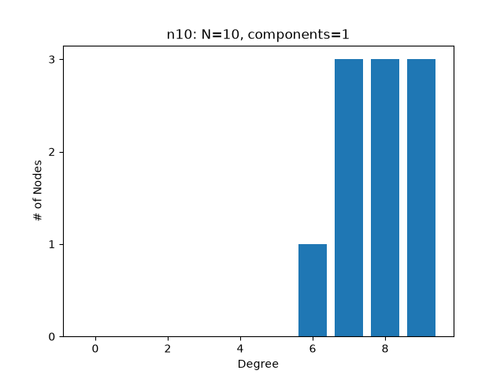
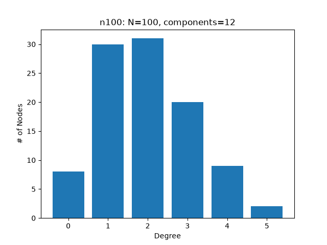
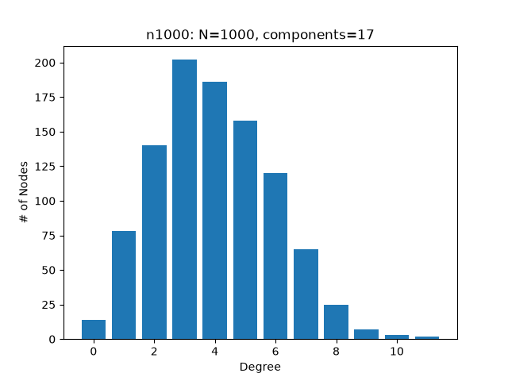
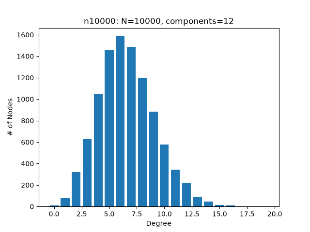
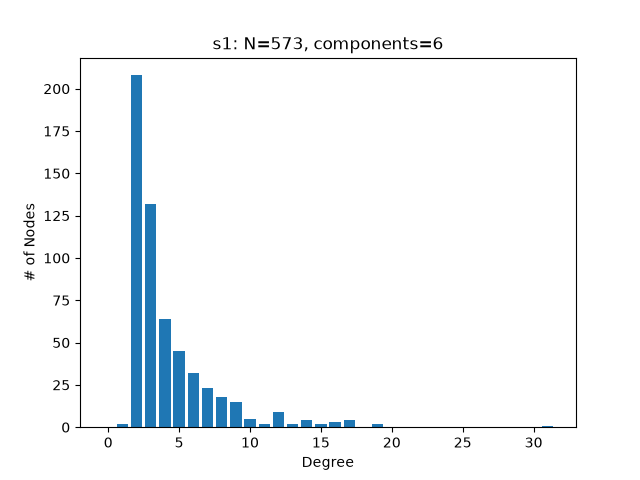

# Wayne Hayes Research Challenge - Graph Theory

Solution to the connected-components + degree-histogram challenge for
Professor Wayne Hayes's applied graph theory / biological network
analysis project.

## How to run
- Requirements: Python 3, matplotlib
- Run `challenge.ipynb`
- Reads each file at the root of `sample_input/` (not the test subfolder),
  prints its component count, and saves a degree histogram to `plots/`.
- The program will check the components algorithm on test graph files to make
  sure it has the correct output, and also assert that the x and y axes data
  is correct before writing a plot.

## Challenge
I was given a set of files that I stored at the root of `sample_input/`.
The first line of each file represents `N`, the number of nodes, and
subsequent lines represent edges. Each node is numbered from 0 to `N-1`.
The goal was to calculate the number of connected components in each
graph. Additionally, I also had to create a histogram of the distribution
of degrees in each graph.

## Approach
1. I stored all of the given input files in `sample_input/`, then looped
   through the directory to analyze each file.
2. For each file, after reading the first line representing `N`, the
   number of nodes, I store the edges represented by the rest of the lines
   in a `defaultdict[int, set]`, with the key being the node, and the value
   being all the connected nodes. I used a `set` so duplicate edges aren't
   counted, and I treated the graph as undirected since I don't need to
   check for strongly connected components. I also use `.strip()` to skip
   over blank/whitespace only lines.
3. To count the number of connected components, I used an iterative DFS
   approach with a stack. For each unvisited node, I'd traverse to every
   other node I could reach from it, marking them visited on the way. I 
   looped from 0 to `N-1` inclusive so isolated nodes were also counted.
   1. I originally tried using a recursive DFS approach, but I hit the
      recursion limit on `n10000.txt`.
4. I also counted how many nodes had each degree in that same loop. The loop
   I do it in checks each node once, so I avoid double-counting. When I went
   to build the plot, I looped from 0 up to the max degree to get the values.
   Any degrees without nodes were given a value of zero. Self loops (`u == v`)
   would affect the degree count, but I checked and there are none in the
   sample files, so this case doesn't occur here. `N == 0` also doesn't occur
   here, but if that does ever happen, the program skips drawing a plot.

### Validation
1. To make sure my logic was correct, I created 3 sample text files in
   `sample_input/test_input`: one with an isolated node, one with all
   nodes connected, and one with no nodes connected. Because I knew the
   results for these graphs, I could assert on them before I ran my code
   on the real files. `assert sum(degrees.values()) == n` checks that
   every node was accounted for when I looped for degree/component counting,
   and I also assert that the component count is what I expected.
2. Additionally, when I'm building the `x` and `y` values for the real files'
   graphs, I assert that the lists are the same length, that `x` goes up to
   the max degree, and that all the values in `y` sum up to `n`.

## Results
| Graph | Nodes (N) | Connected components |
|-------|-----------|----------------------|
| n10    | 10     | 1  |
| n100   | 100    | 12 |
| n1000  | 1000   | 17 |
| n10000 | 10000  | 12 |
| s1     | 573    | 6  |

### Degree distributions

## Commentary & Analysis
I noticed that most of the graphs tend to be right-skewed, with a lot of
nodes having a low degree count. This helps me visualize how the graphs
might look: most nodes are connected to a low-to-moderate amount of
other nodes, and there are a few higher-degree nodes that are connected
to more. `s1.txt` and `n100.txt`, two of the smaller graphs, could follow
the hub-and-spoke model a little closer, since they both peak at 1-2
degrees. `n10.txt` is actually left-skewed, meaning all the nodes are nearly
all connected to each other.

I also noticed that the number of connected components
stayed low throughout the graphs: I thought that the larger the graph, the
more connected components there would be, but `n10000.txt` only had 12, so
node count doesn't necessarily predict component count.